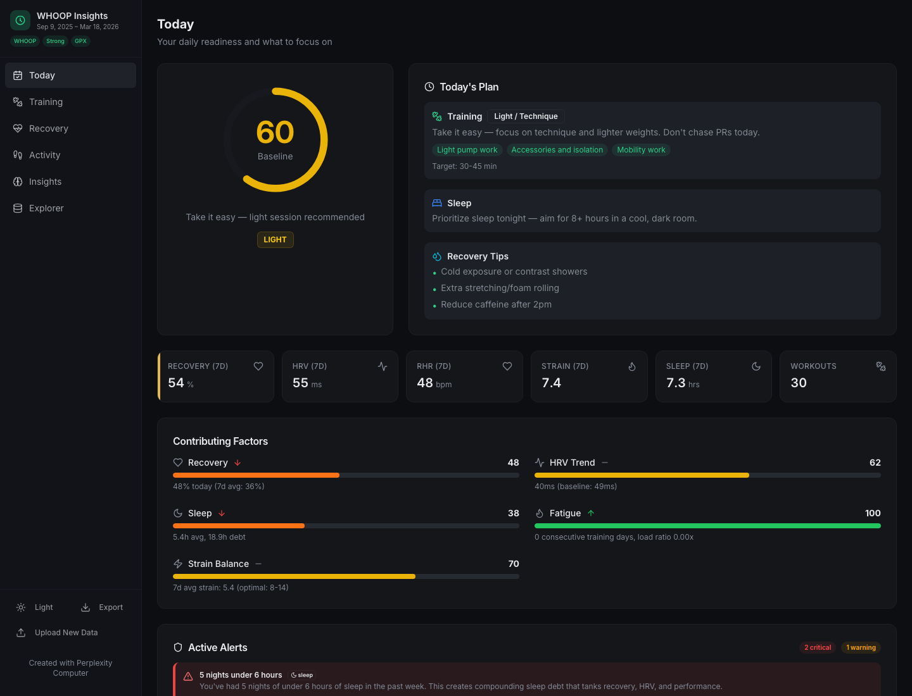
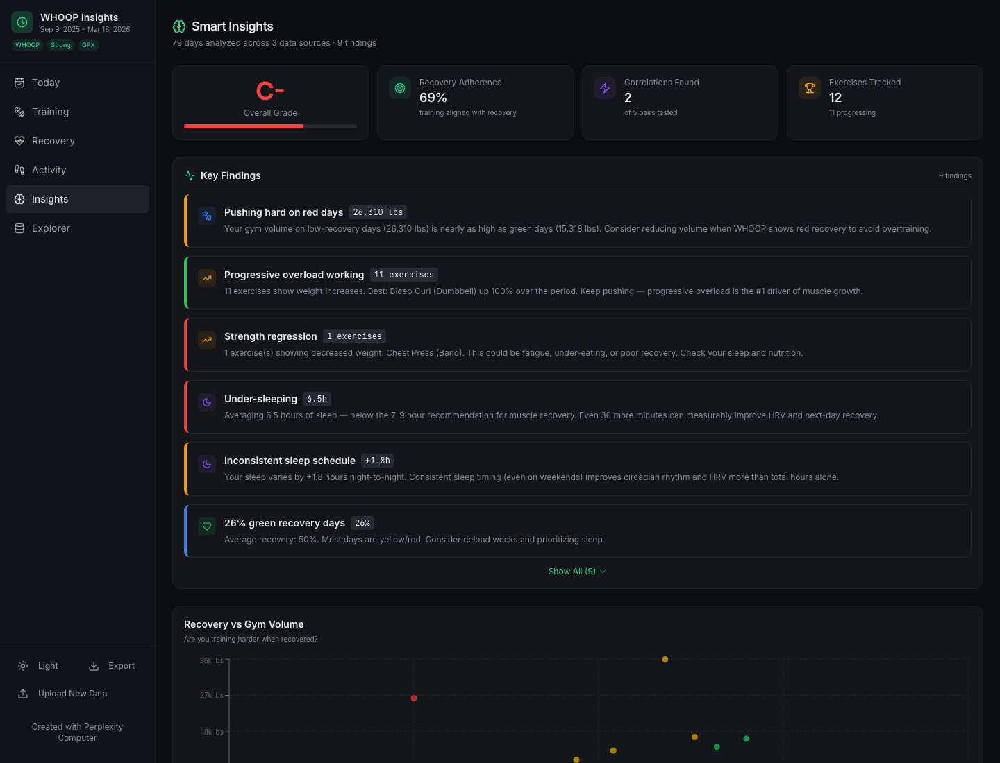

# WHOOP Insights

WHOOP Insights is a privacy-first fitness dashboard for combining WHOOP exports with Strong workouts, Apple Health exports, and GPX routes in one browser-based app.





## Current Launch State

This repository currently ships the static launch bundle exported from Perplexity Computer.

- No backend
- No accounts
- No server-side data processing
- All file parsing and charting run in the browser

## Supported Imports

- WHOOP CSV exports
- Strong CSV exports
- Apple Health `export.xml`
- GPX route files

## Features

- Today summary with readiness and high-level insights
- Training view for gym load and workout trends
- Recovery view for recovery, HRV, and sleep metrics
- Activity view for Apple Health and route activity
- Insights view for correlations and generated findings
- Explorer view for raw-data drilldowns
- Opt-in Gemini assistant for grounded questions about uploaded data

## Local Preview

Because this launch version is a static bundle, you can preview it with any static server.

```bash
cd whoop-insights
python3 -m http.server 4173
```

Then open `http://127.0.0.1:4173`.

## Deploying On Netlify

This repo is configured for Netlify static hosting.

- Import the repository into Netlify
- Publish directory: `.`
- Build command: leave empty
- Production branch: `main`

`netlify.toml` and `_redirects` are included for SPA-friendly routing.

## Privacy

WHOOP Insights is designed so health data stays on the user's device during the current launch phase. Uploaded files are parsed locally in the browser and are not sent to an application backend.

The Gemini assistant is opt-in. When a user enables it and asks a question, the app sends a structured summary of the uploaded data and the question to a Netlify function, which then calls Gemini server-side. The Gemini API key is not shipped to the browser.

## Repository Layout

- `index.html`: launch entry page and social metadata
- `assets/`: bundled JavaScript and CSS from the launch export
- `_redirects`: Netlify SPA fallback
- `docs/screenshots/`: launch screenshots for README and social sharing
- `og-cover.png`: social preview image

## Phase 2

Phase 2 will rebuild this app as a maintainable source project on the `codex/source-rebuild` branch, using the live static app as the product spec before adding Strava and MyFitnessPal imports.
